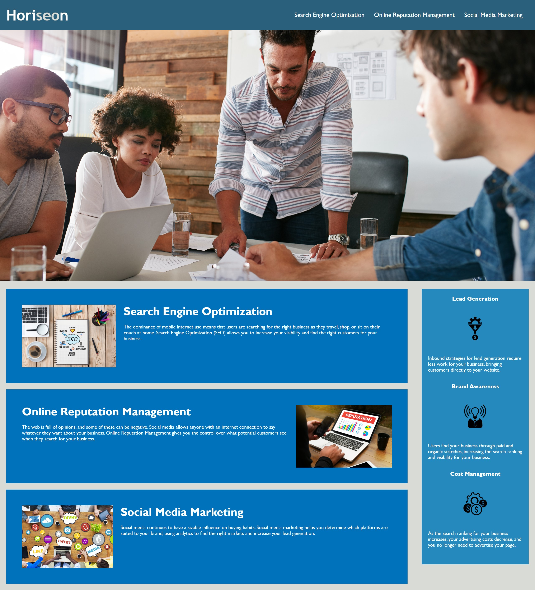

# Module 1 Challenge

## Description

While the webpage loaded fine the code behind it was not up to par.
I reviewed the HTML and CSS and corrected the following:
- Reviewed semantic elements and replaced with proper element where necessary. Along with fixing the application's link
- Revised CSS to avoid redundancy 
- What I learned in this challenge was using proper semantic elements is a top priority. Also, i learned to take each step line by line.

## Usage

Click [link](https://n8trask.github.io/Module-1-Challenge/) to visit functional page.

    

## Credits

**ME MYSELF AND I**